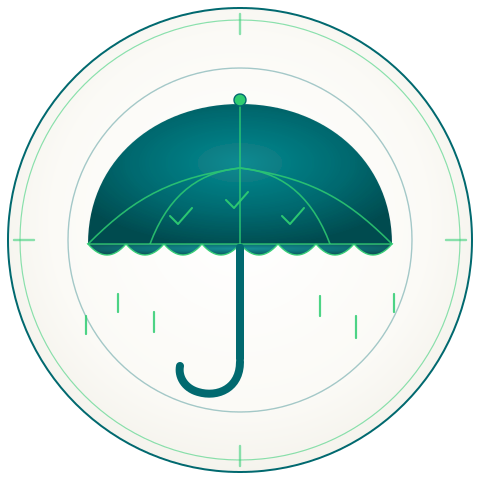

<div align="center">



# Umbrella-GovOps

### The program that binds runtime evidence to AI law.

**Landing page →** [bobrapp.github.io/umbrella-govops](https://bobrapp.github.io/umbrella-govops/)
**Runtime product →** [AiGovOps Beacon](https://github.com/bobrapp/aigovops-beacon) — standalone signing + verification; Umbrella **embeds** its receipts.

`COMPILE THE LAW · BIND THE EVIDENCE · CROSSWALK THE FRAMEWORKS · COVER EVERY SYSTEM`

</div>

---

## What Umbrella-GovOps is

Umbrella-GovOps is the **program layer** of the AiGovOps stack. It compiles AI laws and standards into versioned, citable controls — each anchored by a [Unified Control Identifier (UCID)](UCID-REGISTRY.md) — and **binds runtime evidence**, including [Beacon](https://github.com/bobrapp/aigovops-beacon) receipts and any in-toto attestation, to those controls inside a single signed `EvidenceBundle`.

It is a **framework registry**, not a control library: as new frameworks (NIST AI RMF, EU AI Act, ISO/IEC 42001, OECD, country-specific) are published, Umbrella's job is to crosswalk them onto the existing UCIDs so your runtime telemetry doesn't have to change every time a regulator does.

Governance is not a PDF. It is a pipeline. Every control is a YAML contract. Every assertion is a test. Every audit is a signed artifact — and every signed artifact resolves back, by UCID, to the laws it answers to.

### Beacon and Umbrella — two layers, two cadences

| | **Beacon** (the product) | **Umbrella** (the program) |
|---|---|---|
| Role | Runtime signing + verification of evidence events | Framework registry + control catalog + evidence binder |
| Release cadence | Slow, signed, versioned (≈ 2/year) | Fast, informational (quarterly digests, monthly framework updates) |
| Depends on the other? | **No** — Beacon [runs alone](https://github.com/bobrapp/aigovops-beacon#beacon-runs-alone) | Yes — embeds Beacon receipts in `EvidenceBundle.receipts[]` |
| Identifier surface | OVERT-pure receipts, no `governance` block | UCID registry (IANA-style) — see [UCID-REGISTRY.md](UCID-REGISTRY.md) |

If you only need to prove *what happened*, use Beacon. If you also need to prove *which law it satisfies*, add Umbrella on top.

### Evaluating a vendor or your own approach?

Use the [Policy-as-Code Vendor & Approach Checklist v.3](docs/policy-as-code-vendor-and-approach-checklist-v3.md) — 41 items across cryptographic evidence, identifier governance, architectural posture, standards alignment, crosswalk integrity, and conflict-of-interest. Sections A and B are disqualifying gates.

## Quickstart

```bash
# 1. Install the conformance CLI
pipx install umbrella-conformance       # or: pip install umbrella-conformance

# 2. Validate your repo
umbrella-conformance check .

# 3. Build a signable evidence bundle
umbrella-conformance bundle --out ./out

# 4. (optional) Verify a signed bundle
umbrella-conformance verify ./out/bundle.tar.gz
```

Programmatic access (Python or TypeScript):

```python
from umbrella_sdk import umbrella
u = umbrella()
dg = u.controls.load().by_id("DG-002")
ucid = u.crosswalk.load().resolve("UCID-DATA-BIAS-001")
```

```ts
import { umbrella } from "@aigovops/umbrella-sdk";
const u = umbrella();
const dg = u.controls.load().byId("DG-002");
const ucid = u.crosswalk.load().resolve("UCID-DATA-BIAS-001");
```

See [`conformance/README.md`](conformance/README.md), [`sdk/python/README.md`](sdk/python/README.md), and [`sdk/typescript/README.md`](sdk/typescript/README.md).

## How it relates to AiGovOps Beacon

| | **Umbrella-GovOps** (this repo) | **AiGovOps Beacon** |
|---|---|---|
| Role | Governance **compiler** — rules engine | **Runtime** — discovery + attestation |
| Inputs | OSCAL framework catalogs, YAML controls | Live network, models, prompts, artifacts |
| Outputs | Compiled policy bundle, signed evidence, OSCAL AR | Live receipts, signed bundle for the auditor |
| Question it answers | *What must be true?* | *Is it true right now?* |

Umbrella defines the rules. Beacon proves them in production. Both share the Hydra palette and the AiGovOps Foundation oath.

## The four standards Umbrella stands on

| Layer | Standard | Role |
|---|---|---|
| Control catalog | [NIST OSCAL](https://pages.nist.gov/OSCAL/) (Catalog, Profile, SSP, AR, POA&M) | Machine-readable controls + assessment results |
| Policy evaluation | [Open Policy Agent / Rego](https://openpolicyagent.org) | Deterministic decisions in CI gates |
| Artifact attestation | [in-toto](https://docs.sigstore.dev/cosign/verifying/attestation/) + [SLSA provenance](https://slsa.dev) | Tamper-evident link from source → build → evidence |
| Signing | [Sigstore](https://sigstore.dev) (Cosign + Fulcio + Rekor) and [OpenSSF Model Signing](https://github.com/sigstore/model-transparency) | Keyless, identity-bound signatures with public transparency log |

## Repository structure

```
umbrella-govops/
├── README.md                                  # This blueprint
├── LICENSE                                    # Apache-2.0 + CC-BY-4.0 (docs)
├── CODEOWNERS                                 # Governance-domain owners gate every change
├── SECURITY.md                                # Disclosure, signing identity, key rotation
│
├── .github/
│   ├── workflows/
│   │   ├── govops-ci.yml                      # Master orchestrator (six stages)
│   │   └── pages.yml                          # Publishes docs/ to GitHub Pages
│   └── pull_request_template.md
│
├── docs/                                      # Landing page (served by GitHub Pages)
│   ├── index.html
│   ├── css/site.css
│   └── assets/
│
├── frameworks/                                # Upstream sources of truth (read-mostly)
│   ├── nist-ai-rmf-1.0/catalog.oscal.yaml
│   ├── eu-ai-act/annex-iv-tech-doc.oscal.yaml
│   └── iso-42001/
│
├── domains/                                   # The heart of the repo — ten governance domains
│   ├── data-governance/
│   ├── model-lifecycle/
│   ├── human-oversight/
│   ├── transparency-disclosure/
│   ├── security-robustness/
│   ├── logging-traceability/
│   ├── risk-management-system/
│   ├── post-market-monitoring/
│   ├── incident-response/
│   └── third-party-and-supply-chain/
│
├── policies/                                  # Compiled enforcement layer
│   ├── orchestration.yaml                     # The six-phase DAG
│   ├── rego/                                  # CI gate, deployment gate
│   └── exceptions/                            # Time-boxed, signed waivers
│
├── crosswalks/                                # NIST ↔ EU ↔ ISO via Unified Control IDs
├── evidence/                                  # Generated signed bundles (immutable)
├── reports/                                   # Conformity pack, RMF profile, heatmap
├── systems/                                   # Per-AI-system manifests (the registry)
├── tools/govops/                              # Python engine (compiler, evaluator, attestor)
├── tests/                                     # Self-tests of the governance engine
└── docs/adr/                                  # Architecture decision records
```

Every governance domain follows the same internal layout:

```
domains/<domain>/
├── domain.yaml                 # Owner, scope, risk tier, SLOs
├── controls/                   # YAML controls (one file per control)
├── checks/                     # Executable test scripts (pytest, Python, Rego)
└── evidence-templates/         # Output schemas for collected evidence
```

## The pipeline — six stages

| # | Stage | What runs |
|---|---|---|
| 01 | **Ingest** | Load framework catalogs, schema-validate every YAML |
| 02 | **Classify** | Compute each system's EU AI Act risk tier |
| 03 | **Run** | All ten domains evaluate in parallel — pytest, Python, OPA / Rego |
| 04 | **Crosswalk** | Resolve every result to NIST + EU + ISO via Unified Control IDs |
| 05 | **Sign** | Assemble the bundle, generate in-toto + SLSA attestations, Sigstore-sign, publish Rekor receipt |
| 06 | **Report** | Render OSCAL Assessment Results, Annex IV technical-documentation PDF, cross-framework heatmap |

The DAG is declared in [`policies/orchestration.yaml`](policies/orchestration.yaml). The CI workflow that runs it is in [`.github/workflows/govops-ci.yml`](.github/workflows/govops-ci.yml).

## Anatomy of a control

```yaml
# domains/data-governance/controls/DG-002_bias-evaluation.yaml
apiVersion: govops.aigovops.org/v1
kind: Control
metadata:
  id: DG-002
  ucid: UCID-DATA-BIAS-001          # Stable internal pivot ID
  name: Bias evaluation on training and evaluation datasets
  severity: high
  status: enforced                   # draft | shadow | enforced

satisfies:
  nist_ai_rmf:
    - { subcategory: MEASURE-2.11, coverage: full }
    - { subcategory: MAP-2.3,      coverage: partial }
  eu_ai_act:
    - { article: "10(2)(f)",       coverage: full }
    - { article: "10(3)", annex_iv_section: "2(d)", coverage: full }
  iso_42001:
    - { clause: "A.7.4" }

applies_to:
  risk_tier: [high, limited]
  modality: [tabular, vision, nlp]

checks:
  - id: DG-002.C1
    runner: pytest
    script: domains/data-governance/checks/bias_metrics_test.py::test_demographic_parity
    parameters: { threshold_min: 0.80, threshold_max: 1.25 }
    evidence_outputs: [{ type: metric-report, path: out/bias/dp_ratio.json }]
  - id: DG-002.C3
    runner: opa
    script: domains/data-governance/checks/pii_scan.rego
    query: data.govops.data.no_direct_protected_features

on_fail:
  action: block_merge
  open_poam: true                    # Auto-creates POA&M entry in OSCAL format
```

## Unified Control IDs — one row covers many frameworks

`crosswalks/unified-control-id.yaml` is the pivot. Edit one row, every report reflects it.

```yaml
ucids:
  - id: UCID-DATA-BIAS-001
    nist_ai_rmf:  [MEASURE-2.11, MAP-2.3, MANAGE-2.3]
    eu_ai_act:    { articles: ["10(2)(f)", "10(3)"], annex_iv: ["2(d)", "2(g)"] }
    iso_42001:    ["A.7.4"]
    implementing_controls: [DG-002]
```

## Cryptographic evidence — every bundle has a receipt

Each CI run emits a deterministic tarball plus three sidecar files:

```
bundle-v2026.05.29-1430.tar.zst        ← the bundle
bundle-v2026.05.29-1430.intoto.jsonl   ← in-toto Statement (predicate v1)
bundle-v2026.05.29-1430.slsa.jsonl     ← SLSA provenance predicate
bundle-v2026.05.29-1430.rekor.json     ← Rekor inclusion proof
```

The predicate carries reproducible numeric claims:

```json
{
  "_type": "https://in-toto.io/Statement/v1",
  "subject": [{ "name": "bundle.tar.zst", "digest": { "sha256": "9f3a…" } }],
  "predicateType": "https://aigovops.org/attestations/govops-evidence/v1",
  "predicate": {
    "orchestration": {
      "repo": "bobrapp/umbrella-govops",
      "workflowRef": ".github/workflows/govops-ci.yml@refs/heads/main"
    },
    "scope":    { "systems": ["SYS-001", "SYS-002", "SYS-003"] },
    "results":  { "evaluated": 147, "passed": 144, "failed": 0, "waived": 3 },
    "coverage": { "nist_subcategories": 0.94, "eu_articles": 0.91 }
  }
}
```

Verify any bundle in one command — no Umbrella account required:

```bash
cosign verify-attestation \
  --type https://aigovops.org/attestations/govops-evidence/v1 \
  --certificate-identity-regexp "https://github.com/bobrapp/umbrella-govops/.+" \
  --certificate-oidc-issuer https://token.actions.githubusercontent.com \
  bundle.tar.zst
```

## Cross-framework reporting

Three artifacts, one corpus:

1. **NIST AI RMF Profile** — `reports/nist-rmf-profile/` — OSCAL `assessment-results` covering Govern, Map, Measure, Manage with quarter-over-quarter trend deltas.
2. **EU AI Act Conformity Pack** — `reports/conformity-assessment/` — Annex IV technical documentation (9 sections) plus draft Article 47 declaration.
3. **Cross-framework heatmap** — `reports/cross-framework-heatmap/` — systems × Unified Control IDs; every cell deep-links to the signed evidence line.

## Governance lifecycle hooks

| Event | Trigger | Outcome |
|---|---|---|
| New AI system onboarded | New file in `systems/` | Risk classification runs; orchestration scope expands |
| Framework update (e.g., NIST AI RMF 1.1) | `framework-sync.yml` cron | Auto-PR with diff in `frameworks/`; CODEOWNERS review required |
| Control change | PR touches `domains/**/controls/*.yaml` | Shadow-mode run for 7 days before `status: enforced` |
| Production drift | Nightly `drift-detection.yml` | Issue auto-opened; POA&M entry created |
| Serious incident (EU AI Act Art. 73) | Webhook from runtime monitor | `incident-response` domain assembles signed disclosure pack |
| Quarterly audit | `workflow_dispatch` | Conformity pack + RMF profile + heatmap regenerated and signed |

## Threat model (summary)

The control plane is itself a high-value target. Mitigations encoded in the repo:

- **Branch protection + CODEOWNERS** on `frameworks/`, `policies/`, `crosswalks/` — no single-actor merges.
- **Keyless signing only** — no long-lived keys to exfiltrate; identity bound to workflow ref.
- **Transparency-log dependence** — every bundle's existence is publicly auditable in Rekor.
- **Reproducible builds** — deterministic tarball ordering, pinned tool versions.
- **Exception expiry** — waivers are time-boxed YAML; no perpetual "we'll fix it later."
- **POA&M as first-class output** — gaps are versioned alongside passes; they cannot be hidden.

## Roadmap (suggested first four sprints)

1. **Sprint 1** — Schemas; NIST AI RMF ingestion as OSCAL; three reference controls in `data-governance`.
2. **Sprint 2** — Annex IV ingestion; UCID crosswalk; compiler MVP; first signed bundle in CI.
3. **Sprint 3** — All ten domains stubbed with at least one enforced control; conformity-pack renderer.
4. **Sprint 4** — Drift detection; post-market monitoring webhook; auditor verification CLI; public sample bundle.

## Why this design holds up under audit

- Every claim ties back, by cryptographic hash, to a specific check execution recorded in a public transparency log.
- Every check ties back, by Unified Control ID, to a NIST subcategory *and* an EU AI Act article — no framework is privileged.
- Every waiver expires automatically; the system cannot quietly accumulate technical-governance debt.
- Every framework update is a reviewable PR — auditors see exactly when obligations changed and how the organization responded.

Governance, as code, with receipts.

## Testing

The repo ships a full test pyramid:

| Layer | What it covers | Command |
| --- | --- | --- |
| **Unit** | `umbrella-conformance` CLI surface, JSON Schema strictness, UCID-registry format/uniqueness, YAML parseability of every data file | `make test-unit` |
| **E2E (integration)** | Cross-artifact integrity — no dangling UCID ↔ control references, registry round-trip (load → validate → serialize → reload → equal), CLI against pass/fail fixtures | `PYTHONPATH=. pytest tests/integration` |
| **Scale** | 100 / 1 000 / 10 000 synthetic controls with an SLA of <5 s per 1 000, plus a 1 000-mapping crosswalk-check under 10 s | `make test-scale` (or `make test-scale-10k`) |
| **Chaos** | Deterministic mutations (bad YAML, bad runner, missing checks, bad ID, orphan UCID, dangling implementer) + a random walk; **property-based fuzzing** (Hypothesis) of validators against malformed UCIDs / weird Unicode / huge / missing / extra fields; **filesystem chaos** (missing files, truncated YAML, BOM, EACCES) — every break must be caught cleanly, never crash | `make test-chaos` |

Run everything with `make test-all`. The harness runs on every PR and nightly
via [`.github/workflows/harness.yml`](.github/workflows/harness.yml); the
unit + integration + chaos layers also run inside
[`govops-ci.yml`](.github/workflows/govops-ci.yml), and the scale layer is
gated to the dedicated job + weekly cron. Hypothesis is seeded
(`HYPOTHESIS_SEED`, default `20260601`) so fuzz runs are reproducible.

Full docs: [`tests/README.md`](tests/README.md).

## API & Data Model

Umbrella-GovOps publishes **data contracts**, not a running service. The
[`docs/api/`](docs/api/) directory is the contract reference:

| Doc | Purpose |
| --- | --- |
| [`data-model.md`](docs/api/data-model.md) | Field-by-field reference for every artifact (UCID, Control, GovernanceDomain, EvidenceBundle). |
| [`schema-catalog.md`](docs/api/schema-catalog.md) | Table of every published JSON Schema with path, version, purpose. |
| [`actions.md`](docs/api/actions.md) | The governance action vocabulary — pipeline phases, conformance checks, signing + runtime verbs. |
| [`flows.md`](docs/api/flows.md) | Mermaid sequence diagrams: authoring → compile → validate → sign → attest → bundle → consumption by Beacon and Lantern. |
| [`openapi.yaml`](docs/api/openapi.yaml) | **DRAFT v0** OpenAPI 3.1 contract for the planned admission/governance HTTP API, so downstream projects can code against it. |

---

<sub>© 2026 AiGovOps Foundation · Apache-2.0 · Hydra Teal `#01696f` · Signal Green `#2ecc71`</sub>

## Related Foundation work

- [Redwood v2 (draft FEP)](https://github.com/aigovops-foundation/Redwood-Draft-June-2026) — Foundation Enhancement Proposal currently in WG bootstrap. Tracks ratification of receipt schemas, UCID registry, and viability lens (Ashby + Beer + sociotechnical). See the [ratification project](https://github.com/orgs/aigovops-foundation/projects/1) and [v0.1.0-draft release](https://github.com/aigovops-foundation/Redwood-Draft-June-2026/releases/tag/v0.1.0-draft).
