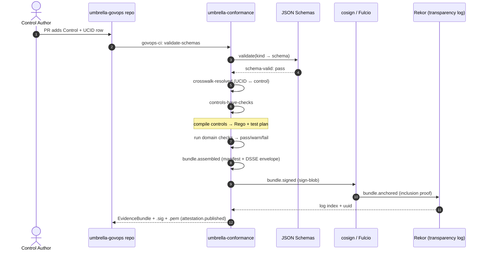
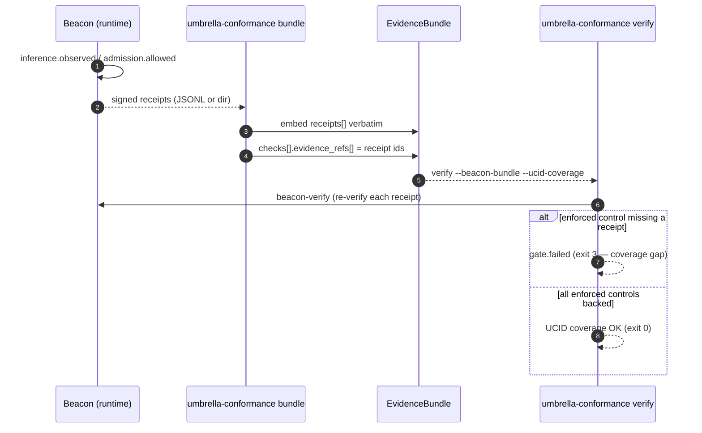
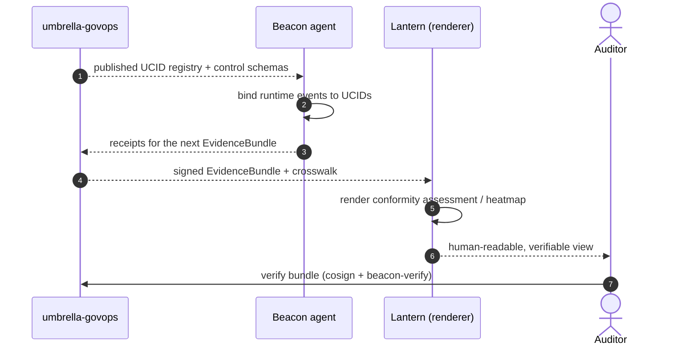
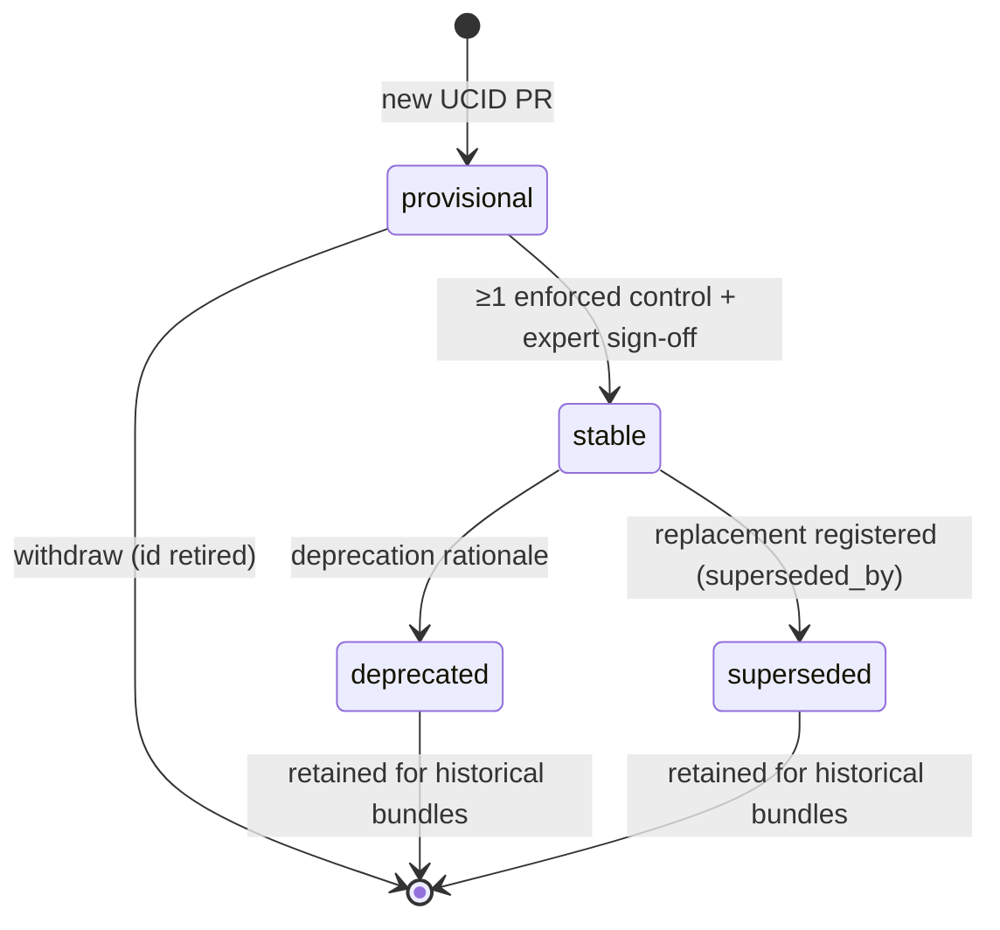
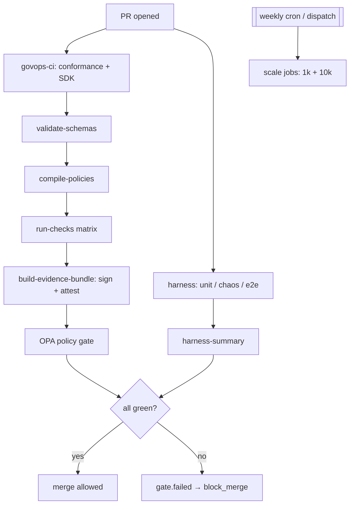

# Flows

End-to-end sequence diagrams for the Umbrella-GovOps lifecycle, from policy
authoring through signed evidence to consumption by the companion products
(Beacon at runtime, Lantern for rendering). Diagrams use
[Mermaid](https://mermaid.js.org/); GitHub renders them inline.

Action verbs used below are defined in [actions.md](actions.md); artifact
shapes in [data-model.md](data-model.md).

---

## 1. Authoring → compile → validate → sign → attest → bundle

The core pipeline that turns hand-authored controls into a signed
`EvidenceBundle`.

---

## 2. Receipt creation → binding → coverage gate

How runtime Beacon receipts become evidence bound to UCIDs.

---

## 3. Consumption by Beacon and rendering by Lantern

Downstream consumption of the published contracts and bundles.

---

## 4. UCID lifecycle (registry state machine)

---

## 5. CI gate flow (govops-ci + harness)

